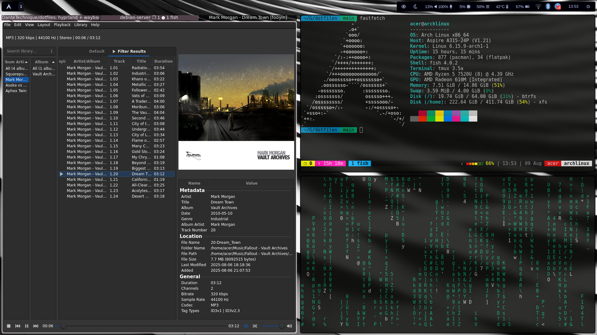
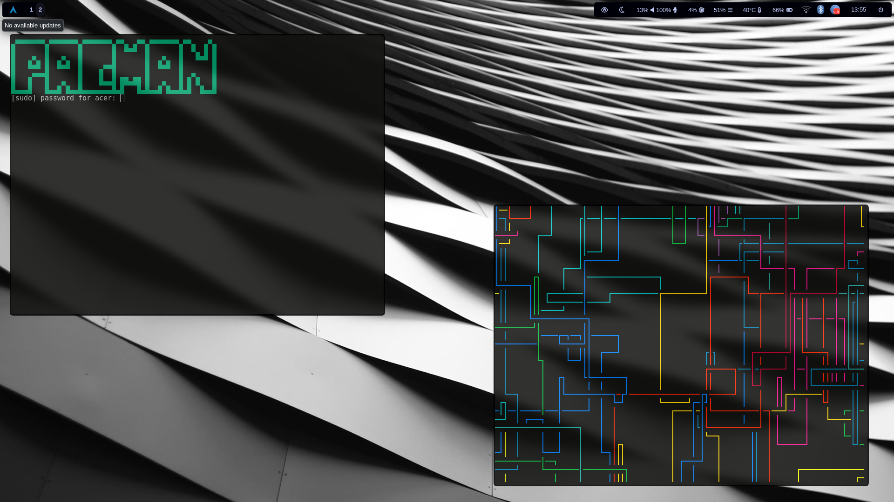

# **HYPRLAND + WAYBAR dotfiles**

my personal hyrpland + waybar dotfiles.

to-do:
- [ ] make install script
- [ ] cool dunst config
- [ ] rework clipboard

## Screenshots

## PACKAGES:
* browser: **watefox**
* file manager: **nemo**
* launcher: **wofi**
* terminal: **alacritty**
* shell: **fish**
* AUR helper: **yay**

other required packages: flatpak, hyprlock, hypridle, hyprsunset, dunst, grim, slurp, wl-clipboard, wlogout, nm-applet, blueman, tmux

